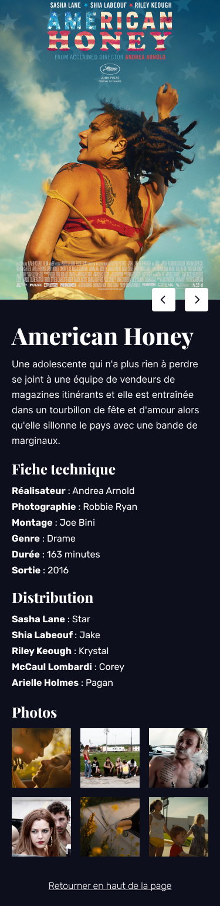

# CPW - CSS : Dossier Juin 2025

> CSS exercise given at HEPL

* * *

**CSS "Movie Encyclopedia"** is an educational project, which will be used for `HTML`/`CSS` courses.

**Note:** the school where the course is given, the [HEPL](http://www.provincedeliege.be/hauteecole) from Liège, Belgium, is a french-speaking school. From this point, the instruction will be in french. Sorry.

* * *

## Movie Encyclopedia

Vous trouverez dans ce dossier quatre pages HTML nommées [**index.html**](./index.html), [**connexion.html**](./html/connexion.html), [**main.html**](./html/main.html) et [**film.html**](./html/film.html). Vous disposez de tout le matériel nécessaire pour réaliser cet exercice dans les dossiers suivants : **img**, **fonts** et **rendus**.

Le rendu final attendu est illustré ci-dessous : 

- 
- 
- 
- 

### Consignes

* Liez le fichier **reset.css** d'[Eric Meyer](https://meyerweb.com/eric/tools/css/reset/) aux différentes pages HTML.
* En vous appuyant sur les rendus attendus dans le fichier Figma, complétez les feuilles de styles CSS.
* Toutes les images à utiliser se trouvent dans le dossier **img**.
* Les polices utilisées sont Rubik et Playfair Display. Elles sont disponibles dans le dossier **fonts**.
* Bon travail et bon amusement&nbsp;!

### Outils

- [css-steptools](https://github.com/tecg-cpw/css-steptools)
- [Comment masquer un élément visuellement ?](https://css-tricks.com/inclusively-hidden/)

Adaptation et intégration par [François Parmentier](https://github.com/fprms).
